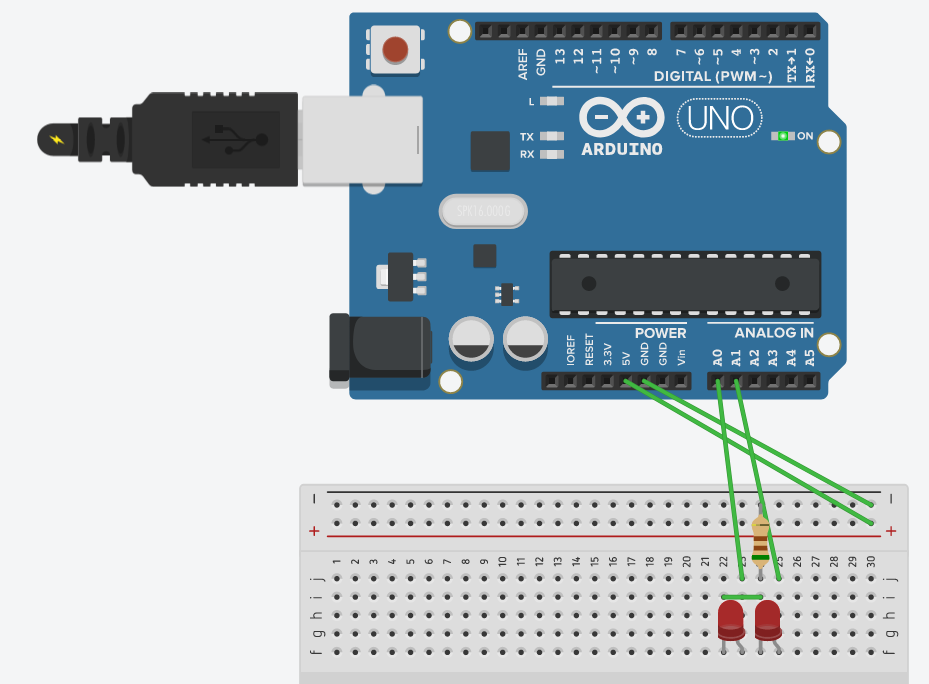
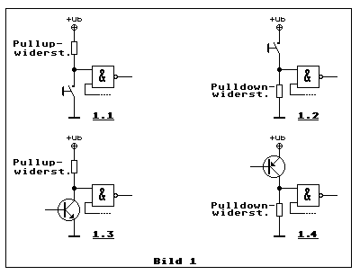
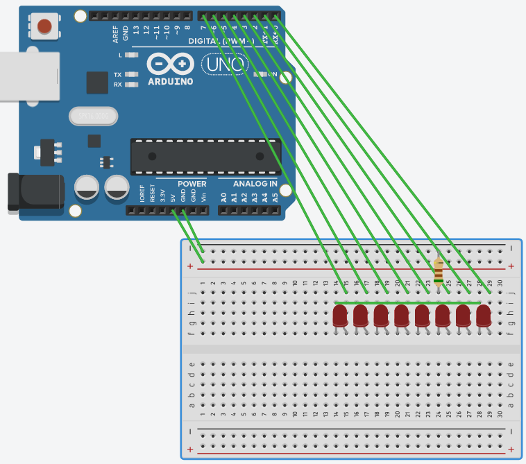

# Mitschriften
## Embeded 1
Basisi is der arduino.  

In tinkercad ist es möglich eine simulation fom Arduino zu machen.  
### 10.04.2024

Mit dem nachfolgenden code ermöglicht dies das abwechselnde Blincken fon 2 LED's.  
```
// C++ code
//
void setup()
{
  pinMode(LED_BUILTIN, OUTPUT);
}

void loop()
{
  /*one led
  //First LED
  digitalWrite(A0, HIGH);
  delay(1000); // Wait for 1000 millisecond(s)
  digitalWrite(A0, LOW);
  delay(1000); // Wait for 1000 millisecond(s)*/
  
  //Second LED
  digitalWrite(A1, LOW);
  digitalWrite(A0, HIGH);
  delay(1000); // Wait for 1000 millisecond(s)
  digitalWrite(A1, HIGH);
  digitalWrite(A0, LOW);
  delay(1000); // Wait for 1000 millisecond(s)
}
```  
Wiederholung Stromteiler <https://de.wikipedia.org/wiki/Spannungsteiler>.  

Unterscheidung von Pullup- und Pulldown-Wiederstand. End frage ist auf welcherr Seite der Wiederstand liegt. Zum GRN oder zur Spannung?   
* Pullupwiederstand:    Wiederstand liegt auf seiten der hohen Spannung (xV).
* Pulldownwiederstand:  Wiederstand liegt auf seiten der niederen spannung (GRND).

Die verwendung dafon ist, dass durch diese ein Definition fom Zustand statfindet -> Unabhängig von Down oder Up. 
Pull-up und down führen zu unterschiedlichen verhalten gegenüber störungen.
 

#### Fiele LED's  
Das nachfolgende Bild Zeigt den Aufbau zur verwendung fieler LED's.
 
Der nachfolgenden Code führt zu einem Periodischen Blinken:
```
// C++ code
//
void setup()
{
  pinMode(PIN0, OUTPUT);
  pinMode(PIN1, OUTPUT);
  pinMode(PIN2, OUTPUT);
  pinMode(PIN3, OUTPUT);
  pinMode(PIN4, OUTPUT);
  pinMode(PIN5, OUTPUT);
  pinMode(PIN6, OUTPUT);
  pinMode(PIN7, OUTPUT);
}

void loop()
{  
  //Second LED
  digitalWrite(PIN0, HIGH);
  digitalWrite(PIN1, HIGH);
  digitalWrite(PIN2, HIGH);
  digitalWrite(PIN3, HIGH);
  digitalWrite(PIN4, HIGH);
  digitalWrite(PIN5, HIGH);
  digitalWrite(PIN6, HIGH);
  digitalWrite(PIN7, HIGH);
  delay(1000); // Wait for 1000 millisecond(s)
  digitalWrite(PIN0, LOW);
  digitalWrite(PIN1, LOW);
  digitalWrite(PIN2, LOW);
  digitalWrite(PIN3, LOW);
  digitalWrite(PIN4, LOW);
  digitalWrite(PIN5, LOW);
  digitalWrite(PIN6, LOW);
  digitalWrite(PIN7, LOW);
  delay(1000); // Wait for 1000 millisecond(s)
}
```
### Wiederholung zum 10.04.2024
Verwendung von Firuteller software zur Simulation eines Arduino. Dabei wurden LED's zum Blinken gebracht.
### 16.04.2024
EVA:
* Eingabe
* Verarbeitung
* Ausgabe  

Es gibt die Prot regiester. Diese entsprechen den Pins am IC. 
Neben diesen Ports gibt es noch die DDR-Regiester deise dienen zur einstellung der Port Pins. 
Das DDRD register gibt an, welche Pins des ProtD wie verwendet werden(In-/Out-Put).
Neben den DDR und Port gibt es auch noch das PIN-Register. Dieses diehnt dazu Daten von den Pins zu Lesen.  

Kompakter Polizei Blinker:
```
// C++ code
//
void setup()
{
  DDRD = 0xff;
}

void loop()
{  
  PORTD = 0x0f;
  delay(200); // Wait for 1000 millisecond(s)
  PORTD = 0xf0;
  delay(200); // Wait for 1000 millisecond(s)
}
```

Der befehl `analogRead(pin)` ermöglicht das ermitteln eines Analogen wertes von einem Pin. Das Ergebniss ist ein integer zwischen 0 und 1023 (10-Bit). 
Der Code zum Auslesen ist der folgende:
```
// C++ code
//
void setup()
{
  DDRD = 0xff;
  PORTD = 1;
  
  pinMode(A1,INPUT);
}

void loop()
{  
  int x = analogRead(A1);
  PORTD = (byte) (x >> 2);
}
```
### HA vom 16.04.2024
Map:
Wandelt eine Zahl in einem Wertebereich in einen anderen Wertebereich um.  
`map(value, fromLow, fromHigh, toLow, toHigh)`
* **value**: Der umzuwnadlende Werte
* **fromLow**: Die untere Grenze des Wertebereiches von value
* **fromHigh**: Die obere Grenze des Wertebereiches von value
* **toLow**: Die untere Grenze des Zielwertebereiches
* **toHigh**: Die obere Grenze des Zielwertebereiches

### Vorlesung 26.04.2024
#### Timer
Zähl register wird dauerhaft hochgezählt.  
Es kann eine Zahl festegelet werden, bei welcher die Grenze/die Ziel zeit gefunden wurde.  
Die Doku ist zu beachten, wie Timer einzustellen sind. FOlgender code bringt eine LED zum blinken mit 1Hz:
```
void setup() {
    DDRD = 0xFF;
	PORTD = 0x00;
  
  	// Counter register
  	TCNT1 = 0;
  
  	// Output Compare register
    OCR1A = 15624;

  	// Timer Config
    TCCR1A = 0;
    TCCR1B = (1 << CS12) | (1 << CS10) | (1 << WGM12); // 1024-Prescaler, Clear on compare match
    TCCR1C = 0;

  	// Interrupt mask
    TIMSK1 = 1 << OCIE1A; // Interrupt on Compare A match
}

void loop() {
}

ISR(TIMER1_COMPA_vect) {
  	PORTD ^= 0x80;
}
```
#### HA
Ablaufdiagram für ein Garagentor öffner(Automatisch) mit schaltern (2). 


### Basis Arduino Programmierung
Es gibt die `setup` und `loop` methoden in der IDE. `Setup` wird ausgeführt, wenn der Arduino hochfährt. Danach wird in einem `while(true)` loop die `loop` funktion ausgeführt.
### Prüfung
Klausurleistung inerhalb der Vorlesung.  
Ein Programm soll geschreiben werden. Mit zugehöriger doku. Zusätzlich müssen diese erklärt werden und fragen zum Code erklärt werden.  


# Ideen
## Kipfenster Roboter

